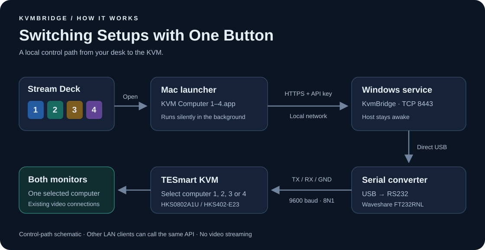
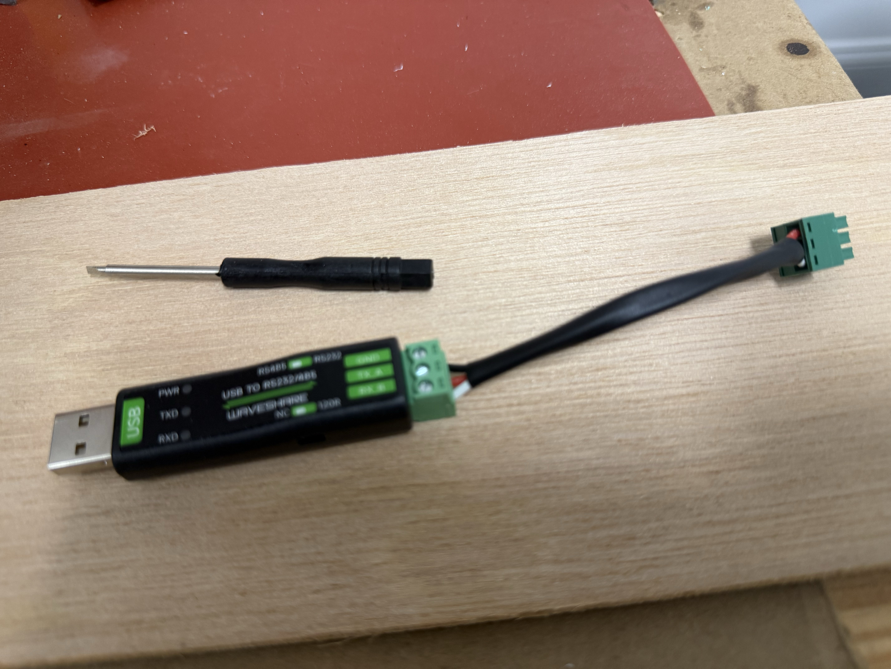
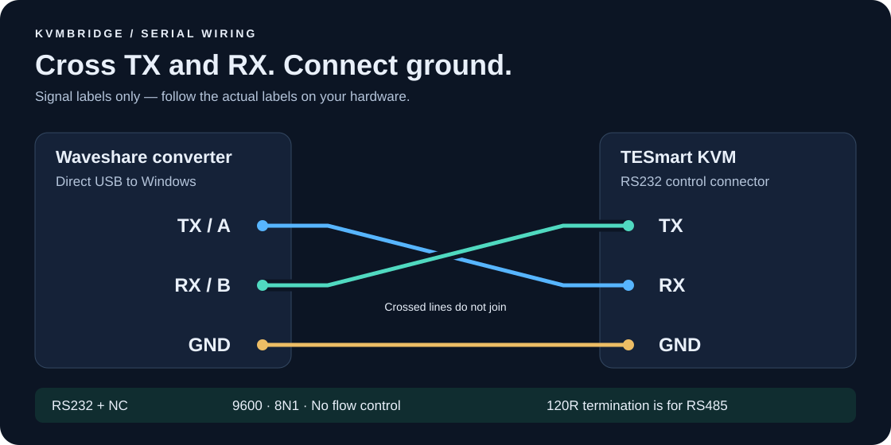

# KvmBridge

[](https://github.com/aic5/kvmbridge/actions/workflows/build.yml)

**Switch both monitors to another computer with one Stream Deck button.**

KvmBridge connects a TESmart KVM to your local network through a Windows host and a
USB-to-RS232 converter. Four silent Mac apps let you select a computer from Stream Deck;
an authenticated HTTPS API lets you do the same from curl or another LAN client.



*The control path. Your existing video and keyboard/mouse connections stay connected
to the KVM; video does not travel through KvmBridge.*

Like the [Face Hugger Fan for DGX Spark](https://github.com/aic5/face-hugger-fan-dgx-spark),
this project adds a small, local control layer to hardware already on the desk.
Here, the result is a button for each computer, backed by a service that translates
network requests into the KVM's serial commands.

[Setup guide](#setup-guide) · [Parts and Amazon associate links](#parts-and-amazon-associate-links) ·
[Troubleshooting](#troubleshooting) · [Documentation](#documentation)

## What you can do

- Select one of four KVM inputs and switch **both monitors together**.
- Use Stream Deck's built-in **System → Open** action, with no plugin or Terminal window.
- Send the same selection from scripts or other computers on your LAN.
- Read the latest observed selection, including changes made on the KVM's front panel.
- Run the Windows service automatically, without signing in, with serial reconnection.

The Windows host must stay awake. The Mac launchers do not wake a sleeping host.
Selection status comes from serial events, so it is **not a live check of the picture
on your monitors**. See [status and compatibility limits](#status-and-compatibility-limits).

## Parts and Amazon associate links

The verified build uses a **TESmart HKS0802A1U**, also listed as **HKS402-E23**, and a
**Waveshare USB to RS232/485 converter with FT232RNL**. Check the exact model before
buying: a similar-looking KVM or serial connector does not establish compatibility.

The Amazon links below are affiliate links. Purchases through these links may earn
me a commission at no additional cost to you.
**As an Amazon Associate I earn from qualifying purchases.**

| Item | Purpose / what to check | Amazon associate link |
| --- | --- | --- |
| USB to RS232/485 serial converter | Use RS232 mode and NC termination; the documented build uses an FT232RNL adapter | [View on Amazon](https://amzn.to/3TOT6Ta) |
| 3.5 mm pitch screw terminal block | Connector for the serial cable; match the pole count, pitch and mating connector on your KVM | [View on Amazon](https://amzn.to/4Ax6VWQ) |
| TESmart four-port dual-monitor DisplayPort KVM switch | Additional working option confirmed by the project author; the original build uses the HDMI model above | [View on Amazon](https://amzn.to/4dyWrwg) |
| Elgato Stream Deck | Optional physical buttons; the guide uses the Mac Stream Deck app | — |

**KVM model note:** The original build uses the HDMI-based HKS0802A1U / HKS402-E23.
The project author has also confirmed that the linked DisplayPort KVM works with
KvmBridge. The detailed wiring and protocol notes describe the original HDMI build.

You also need a **Windows x64 host** with the FTDI VCP driver installed, a **Mac** for
the supplied launchers, and a trusted local network. Keep your existing KVM video and
USB cables. Python 3 is needed for Mac setup; the generated apps use built-in macOS
tools at runtime. The Windows release includes .NET, so no separate runtime is needed.

Manufacturer references: [TESmart model FAQ](https://support.tesmart.com/hc/en-us/articles/24748311049113-HKS402-E23-Previously-HKS0802A1U-FAQ)
and [Waveshare converter documentation](https://www.waveshare.com/wiki/USB_TO_RS232/485).

## Setup guide

### 1. Connect the serial adapter



*The converter and assembled serial cable. Use the signal labels and wiring diagram
below to make the connections; the photo is an assembly reference.*

Start with the KVM's normal monitor and computer connections working. Connect the
USB converter **directly to the Windows host**, rather than to a USB port switched
by the KVM. Set the converter to **RS232** and **NC**, then connect these signals:



| Converter | KVM serial connector |
| --- | --- |
| TX / A | RX |
| RX / B | TX |
| GND | GND |

**TX crosses to RX.** Follow the labels on your hardware; the diagram shows signal
connections, not connector pin positions. `120R` termination is for RS485, not this
RS232 connection. The service uses **9600 baud, 8N1, no flow control**.

Keep Stream Deck connected to the controlling Mac if you want its buttons to remain
available when the KVM changes USB focus.

### 2. Install the Windows service

Get `KvmBridge.exe` from [Releases](https://github.com/aic5/kvmbridge/releases), or
[build it from source](docs/development.md). Open **PowerShell as Administrator**
in the folder containing the executable:

```powershell
.\KvmBridge.exe ports
```

Find the converter's COM port in the output, then install and export the Mac client:

```powershell
.\KvmBridge.exe install --port COM5
.\KvmBridge.exe client --output .\KvmBridge-Mac
```

Replace `COM5` with your port. Alternatively, install with
`--serial YOUR_FTDI_SERIAL` instead of `--port COM5` to follow the adapter when its
COM number changes. There is no machine-specific default.

The installer creates an automatic Windows service, HTTPS certificates, an API key,
and a TCP 8443 firewall rule restricted to the local subnet on **Private/Domain**
networks. Use a trusted network and keep Windows awake.

For a stable address, use a DHCP reservation. You can set `--host YOUR_HOST_OR_IP`
at installation to choose the address covered by the certificate. Changing that
address later may require certificate renewal; see the
[Windows setup and maintenance guide](docs/windows.md).

### 3. Install the Mac controls

Privately transfer the exported `KvmBridge-Mac` folder to the Mac. **It contains your
API key**; keep it out of public repositories and cloud-synced folders.

Download or clone this repository on the Mac. In Terminal, change into its root
folder, then run the following with the actual path to your exported client folder:

```sh
python3 mac/build.py --client /path/to/KvmBridge-Mac --output "$HOME/Applications/KvmBridge"
```

This builds four apps, shell controls, and a status command. Credentials are stored
separately in `~/Library/Application Support/KvmBridge` with private permissions.
Allow **Local Network** access when macOS asks.

If you use the prebuilt apps in the Mac release instead, follow the
[configure-only instructions](docs/mac.md). When updating an existing installation,
also read that guide's app-replacement and credential-update notes.

### 4. Check one switch before setting up the buttons

From Terminal on the Mac, inspect the connection:

```sh
"$HOME/Applications/KvmBridge/status.command"
```

Look for `serialConnected: true`. Selection can be `unknown` immediately after
startup; the service must receive a channel event before it knows the selected input.

Open **KVM Computer 1.app** in `~/Applications/KvmBridge`. Both monitors should
switch to input 1. Run the status command again to check the observed selection.
Display negotiation can take longer than the serial confirmation.

If the monitors do not switch, use the [troubleshooting table](#troubleshooting)
before adding Stream Deck actions. Computer numbers always refer to the KVM's
physical input labels; input 1 is not assumed to be your Mac or Windows host.

### 5. Add four Stream Deck buttons


In the Mac Stream Deck editor:

1. Drag **System → Open** onto a key.
2. Set **App / File** to `KVM Computer 1.app` in your installed apps folder.
3. Give it your computer's name or the title `Computer 1`.
4. Choose [`computer-1.png`](streamdeck/icons/computer-1.png) as the custom icon.
5. Repeat for inputs 2–4 with the matching app and [numbered icon](streamdeck/icons).

Use the `.app` files for silent operation. The apps stay in the background to handle
subsequent presses. The icons identify inputs; they are not live selection indicators.
See [Stream Deck setup](docs/streamdeck.md) for pages, folders and profile backups.

## Control it from a script

The same API works without Stream Deck. This example selects input 1 using the
exported certificate and curl configuration. Replace the paths and example address:

```sh
curl --fail --show-error --max-time 10 \
  --cacert /path/to/KvmBridge-Mac/kvmbridge-ca.pem \
  --config /path/to/KvmBridge-Mac/client.conf \
  -H 'Content-Type: application/json' \
  -X PUT -d '{"computer":1}' \
  https://192.0.2.10:8443/api/kvm/selection
```

`GET /api/kvm/status` returns the latest observed selection. All endpoints require
the API key. Keep certificate verification enabled. See the [API reference](docs/api.md)
for responses, timeouts and status fields.

## Troubleshooting

| What you see | What to check |
| --- | --- |
| Converter absent from the port list | FTDI VCP driver, direct USB connection to Windows, and Device Manager → Ports |
| `serialConnected: false` | Adapter connection and configured COM port or FTDI serial number |
| Serial port connected, but no switch | KVM power, RS232 / NC settings, crossed TX/RX, and shared GND |
| Mac cannot reach Windows | Windows is awake; the server address, Private/Domain profile, firewall rule and Mac Local Network permission are correct |
| Certificate verification fails | The exported CA and server address match the installed certificate; use the renewal guide rather than disabling verification |
| App works, but Stream Deck does nothing | System → Open targets the correct `.app`; inspect the Mac launcher log |
| Status is unknown or stale | Wait for a selection event; status cannot independently query the KVM or prove video is present |

Detailed diagnostics and log locations: [Mac](docs/mac.md) · [Windows](docs/windows.md).

## Status and compatibility limits

**Verified hardware:** TESmart HKS0802A1U / HKS402-E23 with the Waveshare FT232RNL
converter described above. Other TESmart models may use different protocols.

The KVM emits selection events after commands and front-panel changes. **No independent
status query has been verified.** On startup or reconnection, selection is unknown until
an event arrives. An attached USB adapter does not prove the KVM is powered on.
Status includes observation timestamps; it is not a live video-signal check.

Split-display routing, keyboard/USB focus, EDID, and online-computer detection are not
supported. A timeout does not prove a command failed: it may have reached the KVM
without a timely confirmation. The service does not automatically retransmit selections;
the Mac apps retry only when a TCP connection could not be established.
See [protocol findings](docs/protocol.md) and [API behavior](docs/api.md).

## Project status and verification

The predecessor deployment was tested on real hardware: Windows LocalService, COM-port
access, verified HTTPS from macOS, front-panel event tracking, and switching between
inputs. The public package removes that deployment's addresses and adapter identifiers.
Automated tests cover serial parsing, queueing, timeouts, HTTPS, generated curl clients,
and Mac connection recovery. A full host reboot and every supported Windows/macOS version
have not been tested. The Windows executable is unsigned; Mac apps are locally signed,
not notarized.

## Documentation

| Guide | Contents |
| --- | --- |
| [Windows](docs/windows.md) | Installation, service maintenance, certificate renewal and optional SSH tools |
| [Mac](docs/mac.md) | App setup, credentials, logs and connection recovery |
| [Stream Deck](docs/streamdeck.md) | Button setup, pages and profile backups |
| [API](docs/api.md) | Authentication, endpoints, responses and timeouts |
| [Protocol](docs/protocol.md) | Verified serial commands and observation limits |
| [Development](docs/development.md) | Building, tests and release packaging |

## Repository map

| Folder | Contents |
| --- | --- |
| `src/KvmBridge` | C#/.NET 10 Windows service, installer, API, embedded source and tests |
| `mac` | Silent app builder, shell controls and recovery tests |
| `windows` | Optional SSH administration tools |
| `streamdeck` | Original numbered PNG/SVG button icons |
| `docs` | Setup guides, diagrams, API, protocol and development notes |
| `scripts` | Packaging and asset tools |

## Contributing and license

Bug reports, documentation improvements and hardware test results are welcome.
See [CONTRIBUTING.md](CONTRIBUTING.md) and the [security policy](SECURITY.md).

MIT licensed; see [LICENSE](LICENSE). This is an independent project, not affiliated
with TESmart, Waveshare, Elgato, Microsoft, or Apple.
See [NOTICE](NOTICE) for dependency attribution.
