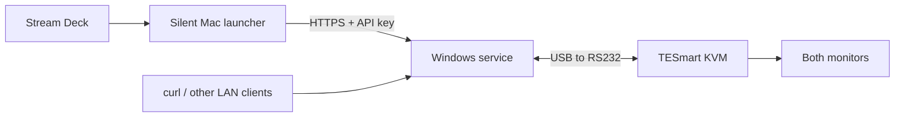

# KvmBridge

[](https://github.com/aic5/kvmbridge/actions/workflows/build.yml)

Control a TESmart KVM from Stream Deck, curl, or another computer on your LAN.
A Windows service talks to the KVM over RS232 and exposes an authenticated HTTPS API.
Four silent Mac apps turn Stream Deck buttons into computer selectors.




## What is included

- **Windows installer:** one self-contained executable, automatic service startup,
  serial reconnection, HTTPS certificates, API credentials, and a local-subnet firewall rule.
- **Mac controls:** four background `.app` launchers, shell commands, a status command,
  connection timing logs, and bounded retries when a TCP connection could not be established.
- **Stream Deck assets:** original numbered icons and a setup guide; no plugin required.
- **Optional SSH tools:** Windows OpenSSH installation, diagnostics, and public-key setup.
- **Source and tests:** C#/.NET 10 service, Python build tools, shell launchers, and CI.

## Supported hardware

Verified with **TESmart HKS0802A1U** (also listed as **HKS402-E23**) and a
**Waveshare USB to RS232/485 converter using FT232RNL**. This controls four computer
inputs and switches both monitors together. Other TESmart models may use different
protocols; compatibility is not implied by connector type or product appearance.

Connect the converter directly to the Windows host. Set it to **RS232** and **NC**:

| Converter | KVM serial connector |
| --- | --- |
| TX / A | RX |
| RX / B | TX |
| GND | GND |

Use the KVM's documented pin labels. **TX crosses to RX.** `120R` termination is for
RS485, not this RS232 connection. Serial settings are **9600, 8N1, no flow control**.

## Quick start

### 1. Windows

Download `KvmBridge.exe` from [Releases](https://github.com/aic5/kvmbridge/releases),
or [build it](docs/development.md). In an **Administrator PowerShell**:

```powershell
.\KvmBridge.exe ports
.\KvmBridge.exe install --port COM5
.\KvmBridge.exe client --output .\KvmBridge-Mac
```

Replace `COM5` with your converter's port. For automatic COM-number changes, use
`install --serial YOUR_FTDI_SERIAL` instead. There is no machine-specific default.
The installer selects a local address for its certificate; `--host YOUR_HOST_OR_IP`
can specify the address you plan to use.

Keep Windows awake and use a trusted **Private/Domain** network. The service starts
without signing in. [Windows setup and maintenance →](docs/windows.md)

### 2. Mac

Privately transfer the exported `KvmBridge-Mac` folder to the Mac. It contains an API
key. From a clone or downloaded source archive, run:

```sh
python3 mac/build.py --client /path/to/KvmBridge-Mac --output "$HOME/Applications/KvmBridge"
```

Python 3 is needed to build; the generated apps use macOS's built-in tools at runtime.
Credentials go into `~/Library/Application Support/KvmBridge`, separately from the apps.
Allow **Local Network** access when macOS asks. [Mac setup and troubleshooting →](docs/mac.md)

### 3. Stream Deck

Drag **System → Open** onto four buttons. Point them at `KVM Computer 1.app` through
`KVM Computer 4.app`, and choose the supplied [button icons](streamdeck/icons).
The apps run without Terminal windows. They remain in the background to handle
subsequent presses. [Stream Deck setup, pages and backups →](docs/streamdeck.md)

Computer numbers are the KVM input labels; no input is assumed to be a Mac or Windows PC.

## API example

Use the exported certificate and curl configuration. Replace the example address:

```sh
curl --fail --show-error --max-time 10 \
  --cacert /path/to/KvmBridge-Mac/kvmbridge-ca.pem \
  --config /path/to/KvmBridge-Mac/client.conf \
  -H 'Content-Type: application/json' \
  -X PUT -d '{"computer":1}' \
  https://192.0.2.10:8443/api/kvm/selection
```

`GET /api/kvm/status` returns the latest observed selection.
[API reference →](docs/api.md)

## Status has limits

The KVM emits selection events after commands and front-panel changes. **No independent
status query has been verified.** On startup or reconnection, selection is unknown until
an event arrives. An attached USB adapter does not prove that the KVM is powered on.
Status includes observation timestamps; it is not a live video-signal check.

Split-display routing, keyboard/USB focus, EDID, and online-computer detection are not
supported. [Protocol findings and limitations →](docs/protocol.md)

## Verification

The predecessor deployment was tested on real hardware: Windows LocalService, COM-port
access, verified HTTPS from macOS, front-panel event tracking, and switching between
inputs. The public package removes that deployment's addresses and adapter identifiers.
Automated tests cover serial parsing, queueing, timeouts, HTTPS, generated curl clients,
and Mac connection recovery. A full host reboot and every supported Windows/macOS version
have not been tested. The Windows executable is unsigned; Mac apps are locally signed,
not notarized.

## Project files

| Folder | Contents |
| --- | --- |
| `src/KvmBridge` | Windows service, installer, API, embedded source, tests |
| `mac` | Silent app builder, shell controls, recovery tests |
| `windows` | Optional SSH administration tools |
| `streamdeck` | Original button icons and setup assets |
| `docs` | Installation, API, protocol, troubleshooting and development |
| `scripts` | Packaging and asset tools |

MIT licensed. This is an independent project, not affiliated with TESmart, Waveshare,
Elgato, Microsoft, or Apple. See [NOTICE](NOTICE) for dependency attribution.
